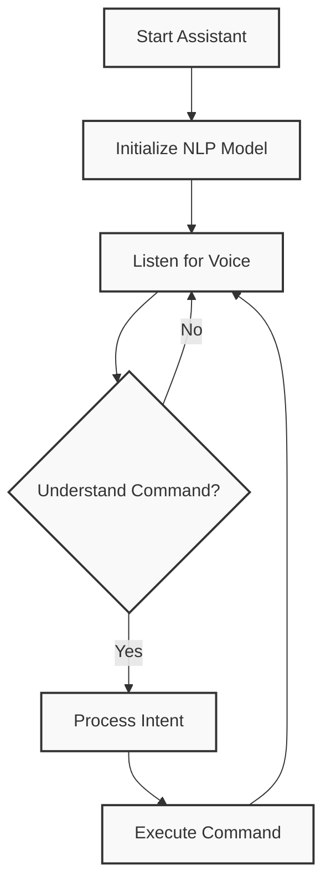

# 🎤 Voice Assistant with NLP

A Python-based voice assistant using natural language processing for intelligent voice commands. 🤖

## ✨ Features

- 🗣️ Voice input/output capabilities  
- 🧠 NLP-based intent classification
- 💡 Command handling:
  - 👋 Greetings
  - ⏰ Time queries
  - 🔍 Web searches
  - 🌤️ Weather info (placeholder)
  - 🎵 Music control (placeholder)

## 📋 Prerequisites

- 🐍 Python 3.7+
- 🔊 PortAudio
- 🎙️ Working microphone

## 🚀 Installation

### 1. Install PortAudio
```bash
# macOS 🍎
brew install portaudio

# Linux 🐧
sudo apt-get install portaudio19-dev  # Ubuntu/Debian
sudo dnf install portaudio-devel      # Fedora

# Windows 🪟
# Download PyAudio wheel from unofficial binaries
```

### 2. Install Dependencies
```bash
pip install SpeechRecognition pyttsx3 transformers torch pyaudio tqdm
```

## 🎯 Usage



1. Start the assistant:
```bash
python assistant.py
```

2. Try these commands:
```
🕐 "What time is it?"
🔍 "Search for weather forecast"
👋 "Hello"
```

## ⚙️ Configuration

Models cached in: `~/.voice_assistant_cache` 
```
📁 .voice_assistant_cache/
 ┣ 📂 models/
 ┃ ┗ 📂 bart-large-mnli/
 ┣ 📂 tokenizers/
 ┗ 📂 configs/
```

## 🔧 Troubleshooting

### 🎙️ Microphone Setup
| OS | Path to Settings |
|------|-----------------|
| macOS | System Settings → Privacy & Security → Microphone |
| Windows | Settings → Privacy → Microphone |
| Linux | `sudo usermod -a -G audio $USER` |

### ❗ Common Errors
```
🔴 "Could not understand audio"
   ↳ Check microphone connection
   ↳ Speak clearly

🔴 "Could not request results"
   ↳ Check internet
   ↳ Verify permissions
```

## 🛠️ Extending

Add intents:
```python
self.intents = {
    "new_intent": ["keyword1", "keyword2"] # ✨
}
```

## 📄 License

MIT ⚖️

## 🤝 Contributing

1. 🔄 Fork
2. 🌱 Branch
3. ⬆️ Pull Request

## 🙏 Acknowledgments

- 🤗 HuggingFace Transformers
- 🎤 SpeechRecognition
- 🗣️ PyTTSx3